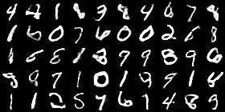
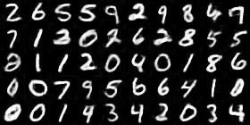
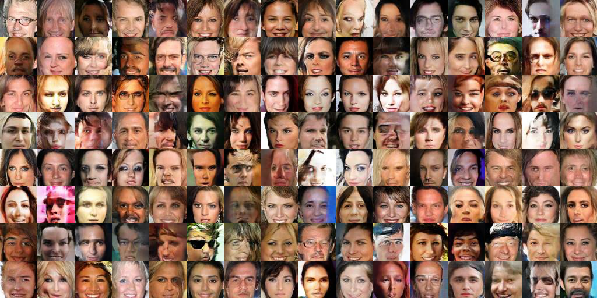
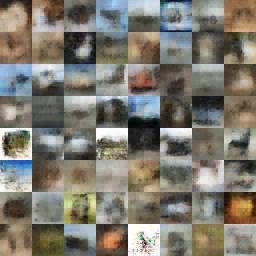

# Adversarial-Autoencoder
A convolutional adversarial autoencoder implementation in pytorch using the WGAN with gradient penalty framework. 

There's a lot to tweak here as far as balancing the adversarial vs reconstruction loss, but this works and I'll update as I go along. 

The MNIST GAN seems to converge at around 30K steps, while CIFAR10 arguably doesn't output anything realistic ever (compared to ACGAN). Nonetheless it starts to looks ok at around 50K steps

The autoencoder components are able to output good reconstructions much faster than the GAN. ~10k steps on MNIST. The auto encoder is currently bad with CIFAR10 (under investigation)

## MNIST Gaussian Samples (GAN) - 33k steps

## MNIST Reconstructions (AE) - 10k steps

## CelebA 64x64 Gaussian Samples (GAN) - 47000 steps

## CIFAR10 Gaussian Samples (GAN) - 200k steps

## CIFAR10 Reconstructions (AE) - 80k steps

clearly need to fix this 

### Requirements

* pytorch 0.2.0
* python 3 - but 2.7 just requires some simple modifications
* matplotlib / numpy / scipy

### Usage

To start training right away just run 

`start.sh`

To train on MNIST

`python3 train.py --dataset mnist --batch_size 50 --dim 32 -o 784`

To train on CIFAR10

`python3 train.py --dataset cifar10 --batch_size 64 --dim 32 -o 3072`

### Acknowledgements

For the wgan-gp components I mostly used [caogang's](https://github.com/caogang/wgan-gp) nice implementation

### TODO

Provide pretrained model files from on a google drive folder (push loader). 
